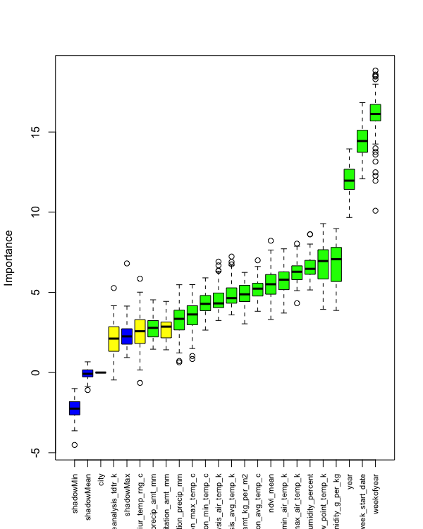
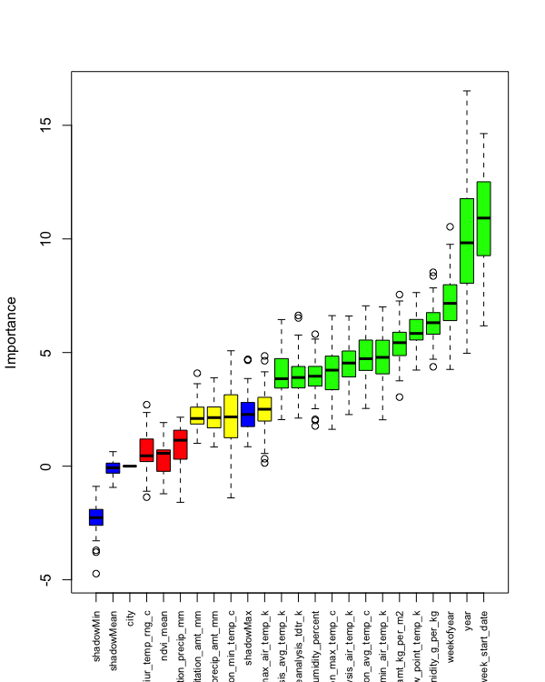

```{r setup, include=FALSE}
knitr::opts_chunk$set(echo = TRUE)

source('Analysis.R')
library('ggplot2')
```

# Data Preperation

To analyze the data we start by loading, cleaning and preparing it. I decided to use R Studio to process the data required for this project. The training data included two files : train_featues.csv and train_labels.csv . For ease of access, I merged the files into a single files by columns ‘weekofyear’, ‘year’, ‘city’. I then split this data into a list of two separate dataframes for each city - San Juan and Iquitos. This would help in finding correlations and strengths of associations for each city separately.

**Missing Values and Eliminating Extra Features**

Looking at the data, we can see that for certain features (eg. Total Precipitation, Avg. Temperature) the data included values from two sources. The sources include

  * NOAA's GHCN daily climate data weather station measurements
  * NOAA's NCEP Climate Forecast System Reanalysis measurements (0.5x0.5 degree scale)

To decide which source would be better for our analysis, I found two data driven reasons in favour of the NOAA's NCEP values.

  1. The correlation of Total Precipitation from each source (GHCN and NCEP) to the total_cases, and n_lag_cases (explained below),      the NCEP values turned out to be much more correlated for both the cities.
  2. The GHCN values contained much more missing values ( > 5% in one case) than NCEP values.
  
Due to these reasons, I eliminated NOAA's GHCN columns from the data. I filled any missing values using with the most recent non-NA value prior to it. We chose this approach over filling the values with mean values because the weather could fluctuate from year to year and filling missing values with the mean might be misleading. In weather data, there is usually a daily pattern (for example, if it rains today, it is fairly likely that it will rain tomorrow) and hence we decided to go with the approach of filling NA values with the previous non-NA values

**Additional Variables**

* **Lagged total cases ( n_lag_cases )**

While researching about the problem, I found that it is safe to assume that the environmental variables may affect the spread of dengue after a certain lag time. This is because there is typically a lag of weeks to months between changes in weather and associated dengue incidence. this lag time could be around 1-3 months. To account for this lag period I created two lag variables four_lag_cases and eight_lag_cases that essentially contain total_cases values shifted up by 4, 8 weeks respectively. I replaced the first n values, after performing a shift, with the previous NA values to give a close approximation of cases. These two new variables can now help us determine if the environmental variables are correlated to dengue cases reported after n weeks.

* **Mean Vegetation (ndvi_mean)**

The starter data also included Normalized difference vegetation index divided into four pixels in each direction from the centroid of the city. In order to get a better sense of the overall vegetation index of the city and obtain a single value for analysis, I created a new variable called ndvi_mean which, as the name suggests, is the mean of the four vegetation indexes of each week

After performing basic data preperation and adding additional variables the metadata looks like the following.

```
city
year
weekofyear
reanalysis_sat_precip_amt_mm (Total Precipitation)
reanalysis_dew_point_temp_k (Mean Dew Point Temperature)
ndvi_se (Pixel southeast of city centroid)
ndvi_sw (Pixel southwest of city centroid)
ndvi_ne (Pixel northeast of city centroid)
ndvi_nw (Pixel northwest of city centroid)
reanalysis_precip_amt_kg_per_m2 (Total Precipitation)
reanalysis_max_air_temp_k (Maximum Air Temperature)
reanalysis_min_air_temp_k (Minimum Air Temperature)
reanalysis_avg_temp_k (Average Air Temperature)
reanalysis_tdtr_k (Diurnal temperature range)
four_lag_cases
eight_lag_cases
ndvi_mean
```
**Splitting your data into train/test sets**

#Feature selection

##Variance

First we checked the variance of each variable so that we can removing features with low variance or no variance at all, because this would imply that these values aren’t changing over time and hence no effect on the outcome which is total cases. 

```
> names(sj_joined)[nearZeroVar(sj_joined)]
character(0)
> names(iq_joined)[nearZeroVar(iq_joined)]
character(0)
```

From this we can see that there is no feature that doesn’t change over time and hence no need for us to remove any feature based on the results from this test.

## Removing Redundant Features

This data set might contain attributes that are highly correlated with each other. Many methods perform better if highly correlated attributes are removed. We are using the findCorrelation method from the Caret package 

```
> print(highlyCorrelatedSJ)
[1] 17 11  9 10 13   3 20 

> print(highlyCorrelatedIQ)
[1] 17 11  12 10  8  6  7  5
```

We see that in the San Juan and Iquitos data set columns 17 and 11 are highly correlated, to better test this out let us plot a scatter graph of how reanalysis_specific_humidity_g_per_kg varies with reanalysis_dew_point_temp_k. We can see from the graph that these two variables are highly correlated. To increase the accuracy of our model we are going to combine these two variables into one and call it heat index. Heat index is a measure indicating the level of discomfort the average person is thought to experience as a result of the combined effects of the temperature and humidity of the air.

```{r echo=FALSE, message=FALSE}
plot(dew_vs_hum)
```

From the results we can also see that in the San Juan data set the reanalysis_air_temp_k, reanalysis_min_air_temp_k and reanalysis_avg_temp_k are highly correlated. In the Iquitos data set reanalysis_avg_temp_k and reanalysis_max_air_temp_k are highly correlates, it would benefit us to use only one of these variables.


## Correlation Heatmap 

Correlation heatmap plots are used to visualize association matrices. The color indicates the sign of the coefficient and the intensity of the color increases proportionally with the magnitude of the correlation coefficient. We can use this graphs to remove variables with high correlation to either mutate them into one, or pick the better variable.

```{r}
corrplot(m_sj_train_features, type = 'full', tl.col = 'black', method="shade")
corrplot(m_iq_train_features, type = 'full', tl.col = 'black', method = 'shade')
```

To better understand what features we need to select for our model, let us try and understand how important each variable is to our model.


## Rank Features By Importance

We used **Recursive Feature Elimination Method** to obtain the best subset of the feature variables. It is a greedy optimization algorithm which aims to find the best performing feature subset. It repeatedly creates models and keeps aside the best or the worst performing feature at each iteration. It constructs the next model with the left features until all the features are exhausted. It then ranks the features based on the order of their elimination. We used Recursive Feature Elimination Method instead of Forward Selection method because we learned that the former provides more accurate and detailed feature selection algorithm, and we wanted to experiment a new method as well, in fact, it turned out very successful.

Using the recursive feature elimination, we were abled to compute the importance of each variable is to the Response (total_cases). In other words, we noticed that after 13 variables, the new variable being added to model depreciates the accuracy of the model. This is represented clearly in the graph below:

**Importance of each variable in San Juan data**




**Importance of each variable in Iquitos data**



An interesting observation to note from the above plot is that the different factors seem to contribute towards the dissemination of the dengue virus and aedes mosquito, and this provides more clarity. We cannot model San Juan data and Iquitos data together as they both are dependent on different variables. Judging on the importance of these variables we can see that for the San Juan data min_air_temp has more importance than reanalysis_air_temp_k and reanalysis_avg_temp_k so **we choose to eliminate these two features**. From the importance of variables in the Iquitos data set as we can see that reanalysis_avg_temp_k has a higher importance than reanalysis_max_air_temp_k so we choose to eliminate reanalysis_max_air_temp_k from the Iquitos data set. We also only selected the top 7 most important features as having more variables might decrease the accuracy of the model.

**Here are the final features selected for the San Juan model:**
```{r}
colnames(sj_joined)
```

**Here are the final features selected for the Iquitos model**
```{r}
colnames(iq_joined)
```


