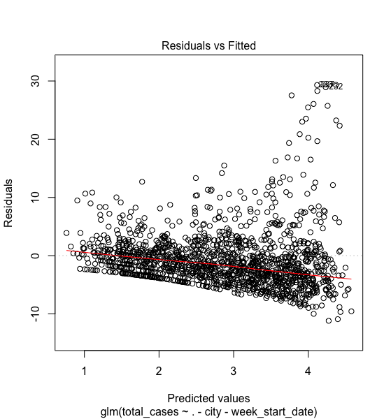
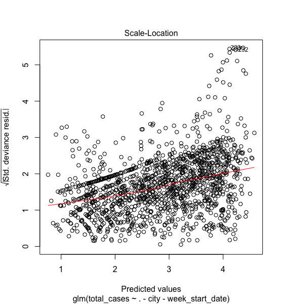
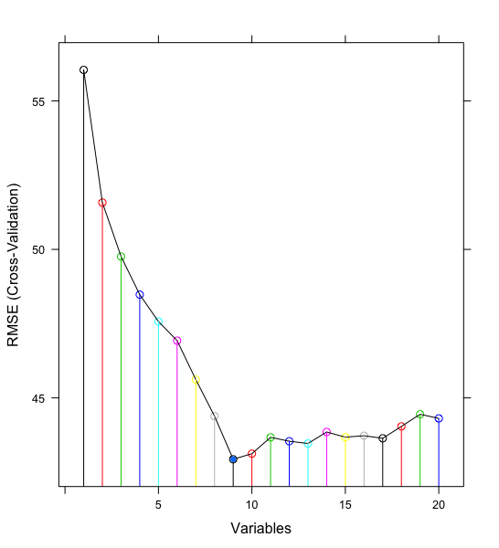
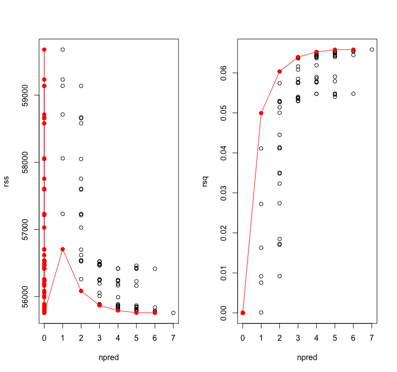
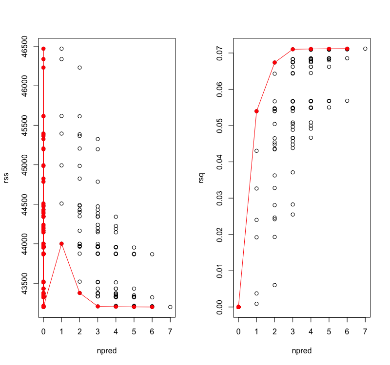
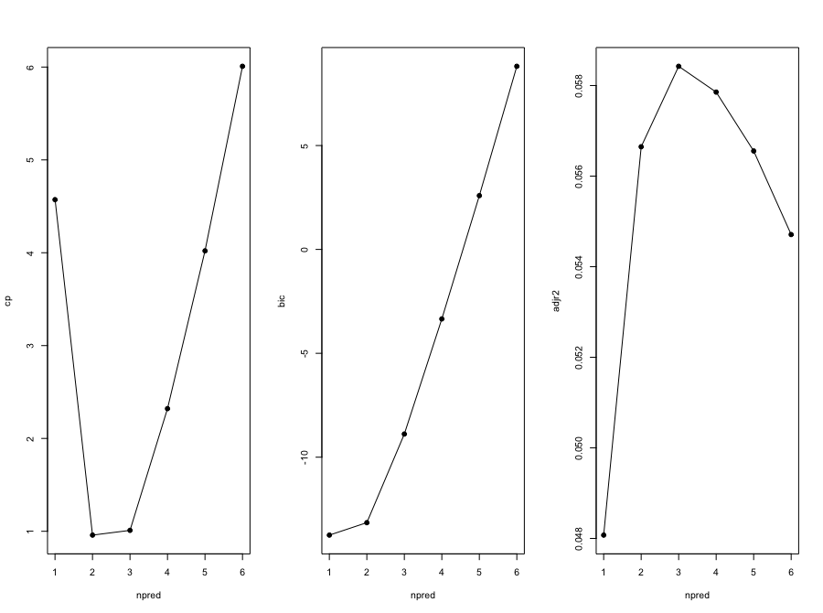
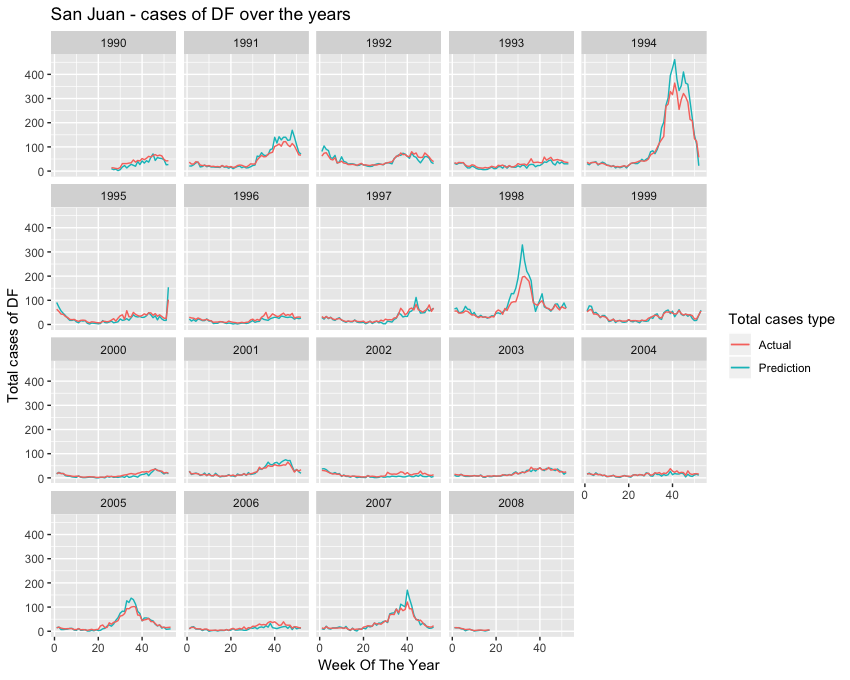
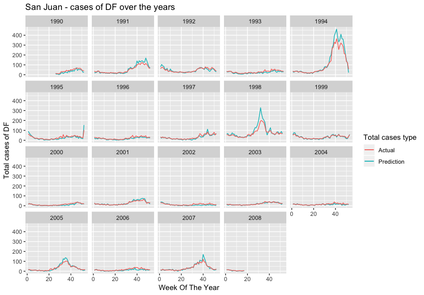

```{r setup, include=FALSE}
knitr::opts_chunk$set(echo = TRUE)

source('Analysis.r')
library('ggplot2')
```

# Data Preperation

To analyze the data we start by loading, cleaning and preparing it. I decided to use R Studio to process the data required for this project. The training data included two files : train_featues.csv and train_labels.csv . For ease of access, I merged the files into a single files by columns ‘weekofyear’, ‘year’, ‘city’. I then split this data into a list of two separate dataframes for each city - San Juan and Iquitos. This would help in finding correlations and strengths of associations for each city separately.

**Missing Values and Eliminating Extra Features**

Looking at the data, we can see that for certain features (eg. Total Precipitation, Avg. Temperature) the data included values from two sources. The sources include

  * NOAA's GHCN daily climate data weather station measurements
  * NOAA's NCEP Climate Forecast System Reanalysis measurements (0.5x0.5 degree scale)

To decide which source would be better for our analysis, I found two data driven reasons in favour of the NOAA's NCEP values.

  1. The correlation of Total Precipitation from each source (GHCN and NCEP) to the total_cases, and n_lag_cases (explained below),      the NCEP values turned out to be much more correlated for both the cities.
  2. The GHCN values contained much more missing values ( > 5% in one case) than NCEP values.
  
Due to these reasons, I eliminated NOAA's GHCN columns from the data. I filled any missing values using with the most recent non-NA value prior to it. We chose this approach over filling the values with mean values because the weather could fluctuate from year to year and filling missing values with the mean might be misleading. In weather data, there is usually a daily pattern (for example, if it rains today, it is fairly likely that it will rain tomorrow) and hence we decided to go with the approach of filling NA values with the previous non-NA values

**Additional Variables**

* **Lagged total cases ( n_lag_cases )**

While researching about the problem, I found that it is safe to assume that the environmental variables may affect the spread of dengue after a certain lag time. This is because there is typically a lag of weeks to months between changes in weather and associated dengue incidence. this lag time could be around 1-3 months. To account for this lag period I created two lag variables four_lag_cases and eight_lag_cases that essentially contain total_cases values shifted up by 4, 8 weeks respectively. I replaced the first n values, after performing a shift, with the previous NA values to give a close approximation of cases. These two new variables can now help us determine if the environmental variables are correlated to dengue cases reported after n weeks.

* **Mean Vegetation (ndvi_mean)**

The starter data also included Normalized difference vegetation index divided into four pixels in each direction from the centroid of the city. In order to get a better sense of the overall vegetation index of the city and obtain a single value for analysis, I created a new variable called ndvi_mean which, as the name suggests, is the mean of the four vegetation indexes of each week

After performing basic data preperation and adding additional variables the metadata looks like the following.

```
city
year
weekofyear
reanalysis_sat_precip_amt_mm (Total Precipitation)
reanalysis_dew_point_temp_k (Mean Dew Point Temperature)
ndvi_se (Pixel southeast of city centroid)
ndvi_sw (Pixel southwest of city centroid)
ndvi_ne (Pixel northeast of city centroid)
ndvi_nw (Pixel northwest of city centroid)
reanalysis_precip_amt_kg_per_m2 (Total Precipitation)
reanalysis_max_air_temp_k (Maximum Air Temperature)
reanalysis_min_air_temp_k (Minimum Air Temperature)
reanalysis_avg_temp_k (Average Air Temperature)
reanalysis_tdtr_k (Diurnal temperature range)
four_lag_cases
eight_lag_cases
ndvi_mean
```
**Splitting your data into train/test sets**

We split the data set using random selection, and with the ratio training data to testing data equalis 3:1. 

```
set.seed(10)
trainIndex = createDataPartition(sj_joined$total_cases,
                                 p=0.75, list=FALSE,times=1)
train_data_sj <- sj_joined[trainIndex,]
test_data_sj <- sj_joined[-trainIndex,]


trainIndex = createDataPartition(iq_joined$total_cases,
                                 p=0.75, list=FALSE,times=1)
train_data_iq <- iq_joined[trainIndex,]
test_data_iq <- iq_joined[-trainIndex,]
```

#Feature selection

##Variance

First we checked the variance of each variable so that we can removing features with low variance or no variance at all, because this would imply that these values aren’t changing over time and hence no effect on the outcome which is total cases. 

```
> names(sj_joined)[nearZeroVar(sj_joined)]
character(0)
> names(iq_joined)[nearZeroVar(iq_joined)]
character(0)
```

From this we can see that there is no feature that doesn’t change over time and hence no need for us to remove any feature based on the results from this test.

## Removing Redundant Features

This data set might contain attributes that are highly correlated with each other. Many methods perform better if highly correlated attributes are removed. We are using the findCorrelation method from the Caret package 

```
> print(highlyCorrelatedSJ)
[1] 17 11  9 10 13   3 20 

> print(highlyCorrelatedIQ)
[1] 17 11  12 10  8  6  7  5
```

We see that in the San Juan and Iquitos data set columns 17 and 11 are highly correlated, to better test this out let us plot a scatter graph of how reanalysis_specific_humidity_g_per_kg varies with reanalysis_dew_point_temp_k. We can see from the graph that these two variables are highly correlated. To increase the accuracy of our model we are going to combine these two variables into one and call it heat index. 

```{r echo=FALSE, message=FALSE}
plot(dew_vs_hum)
```

From the results we can also see that in the San Juan data set the reanalysis_air_temp_k, reanalysis_min_air_temp_k and reanalysis_avg_temp_k are highly correlated. In the Iquitos data set reanalysis_avg_temp_k and reanalysis_max_air_temp_k are highly correlates, it would benefit us to use only one of these variables.

## Correlation Heatmap 

Correlation heatmap plots are used to visualize association matrices. The color indicates the sign of the coefficient and the intensity of the color increases proportionally with the magnitude of the correlation coefficient. We can use this graphs to remove variables with high correlation to either mutate them into one, or pick the better variable.

```{r}
corrplot(m_sj_train_features, type = 'full', tl.col = 'black', method="shade")
corrplot(m_iq_train_features, type = 'full', tl.col = 'black', method = 'shade')
```

To better understand what features we need to select for our model, let us try and understand how important each variable is to our model.


## Rank Features By Importance

We used **Recursive Feature Elimination Method** to obtain the best subset of the feature variables. It is a greedy optimization algorithm which aims to find the best performing feature subset. It repeatedly creates models and keeps aside the best or the worst performing feature at each iteration. It constructs the next model with the left features until all the features are exhausted. It then ranks the features based on the order of their elimination. We used Recursive Feature Elimination Method instead of Forward Selection method because we learned that the former provides more accurate and detailed feature selection algorithm, and we wanted to experiment a new method as well, in fact, it turned out very successful.

Using the recursive feature elimination, we were abled to compute the importance of each variable is to the Response (total_cases). In other words, we noticed that after 13 variables, the new variable being added to model depreciates the accuracy of the model. This is represented clearly in the graph below:

**Importance of each variable in San Juan data**


**Importance of each variable in Iquitos data**


An interesting observation to note from the above plot is that the different factors seem to contribute towards the dissemination of the dengue virus and aedes mosquito, and this provides more clarity. We cannot model San Juan data and Iquitos data together as they both are dependent on different variables. Judging on the importance of these variables we can see that for the San Juan data min_air_temp has more importance than reanalysis_air_temp_k and reanalysis_avg_temp_k so **we choose to eliminate these two features**. From the importance of variables in the Iquitos data set as we can see that reanalysis_avg_temp_k has a higher importance than reanalysis_max_air_temp_k so we choose to eliminate reanalysis_max_air_temp_k from the Iquitos data set. We also only selected the top 13 most important features as having more variables might decrease the accuracy of the model.


# Modeling

In this report, we will be discussing four machine techniques and deploying them to model our data and predict the total number of cases for both cities. These models are -

1. *Poisson Regression*
2. *Negative Binomial Approah*
3. *Random Forest Method*
4. *Gradient Boosting Algorithm - XGBoost*

### 1. Poisson Regression 

Here we are using poisson regression because our target variable - Total Cases, is a countable variable, a count variable is something that can take only non-negative integer values. Poisson regression models count variables that assumes poisson distribution. When the count variable is over dispersed, having to much variation, Negative Binomial regression is more suitable. Poisson regression can be implemented in a similar manner as other Generalised Linear Models (GLMs), by adjusting the family argument to poisson. 

**Poisson Regression for SJ data**


```
Call:
glm(formula = total_cases ~ ., family = "poisson", data = sj_joined)

Deviance Residuals: 
   Min      1Q  Median      3Q     Max  
-9.694  -4.195  -2.014   1.139  28.340  

Coefficients:
                                       Estimate Std. Error z value Pr(>|z|)    
(Intercept)                          93.1716971  2.9163266  31.948  < 2e-16 ***
year                                 -0.0825913  0.0013593 -60.758  < 2e-16 ***
weekofyear                            0.0222401  0.0004767  46.657  < 2e-16 ***
heat_index                           -0.0344686  0.0046771  -7.370 1.71e-13 ***
reanalysis_relative_humidity_percent  0.0098853  0.0040810   2.422   0.0154 *  
reanalysis_max_air_temp_k             0.3196131  0.0130859  24.424  < 2e-16 ***
ndvi_mean                            -2.2907585  0.1166426 -19.639  < 2e-16 ***
reanalysis_precip_amt_kg_per_m2       0.0007349  0.0001693   4.340 1.42e-05 ***
---
Signif. codes:  0 ‘***’ 0.001 ‘**’ 0.01 ‘*’ 0.05 ‘.’ 0.1 ‘ ’ 1

(Dispersion parameter for poisson family taken to be 1)

    Null deviance: 39151  on 927  degrees of freedom
Residual deviance: 28220  on 920  degrees of freedom
AIC: 32667

Number of Fisher Scoring iterations: 5
```


**Poisson Regression for IQ**


```
Call:
glm(formula = total_cases ~ ., family = "poisson", data = iq_joined)

Deviance Residuals: 
    Min       1Q   Median       3Q      Max  
-4.9752  -2.6717  -1.2179   0.5211  19.6354  

Coefficients:
                                       Estimate Std. Error z value Pr(>|z|)    
(Intercept)                          -1.837e+02  2.298e+01  -7.996 1.28e-15 ***
year                                  5.225e-02  5.959e-03   8.768  < 2e-16 ***
weekofyear                            1.079e-04  1.050e-03   0.103 0.918156    
heat_index                            2.835e-02  5.849e-02   0.485 0.627856    
reanalysis_precip_amt_kg_per_m2      -1.231e-03  3.987e-04  -3.088 0.002014 ** 
reanalysis_min_air_temp_k             6.030e-02  1.806e-02   3.340 0.000839 ***
reanalysis_air_temp_k                 1.442e-01  1.856e-01   0.777 0.437064    
reanalysis_relative_humidity_percent  2.359e-02  4.128e-02   0.572 0.567602    
---
Signif. codes:  0 ‘***’ 0.001 ‘**’ 0.01 ‘*’ 0.05 ‘.’ 0.1 ‘ ’ 1

(Dispersion parameter for poisson family taken to be 1)

    Null deviance: 5232  on 511  degrees of freedom
Residual deviance: 4681  on 504  degrees of freedom
AIC: 6232.3

Number of Fisher Scoring iterations: 6
```

### 2. Negative Binomial Approach

We performed the analysis using *Negative Binomial Regression* as well, Negative binomial regression can be used for over-dispersed count data, that is when the conditional variance exceeds the conditional mean. However, Negative binomial regression can be considered as a generalization of Poisson regression since it has the same mean structure as Poisson regression and it has an extra parameter to model the over-dispersion. If the conditional distribution of the outcome variable is over-dispersed, the confidence intervals for Negative binomial regression are likely to be narrower as compared to those from a Poisson regression. Thus, our outputs were very similar, and poisson regression outperformed negative binomial regression by a very narrow margin.

**Negative Binomial Regression for SJ Data**


```
Call:
glm.nb(formula = total_cases ~ ., data = sj_joined, init.theta = 1.332127135, 
    link = log)

Deviance Residuals: 
    Min       1Q   Median       3Q      Max  
-2.8144  -0.9907  -0.4472   0.2212   3.3674  

Coefficients:
                                       Estimate Std. Error z value Pr(>|z|)    
(Intercept)                          120.380758  14.960426   8.047 8.51e-16 ***
year                                  -0.090972   0.006987 -13.019  < 2e-16 ***
weekofyear                             0.013001   0.002503   5.195 2.05e-07 ***
heat_index                             0.023788   0.023701   1.004  0.31554    
reanalysis_relative_humidity_percent  -0.035927   0.020877  -1.721  0.08527 .  
reanalysis_max_air_temp_k              0.172823   0.066406   2.603  0.00925 ** 
ndvi_mean                             -1.452332   0.577256  -2.516  0.01187 *  
reanalysis_precip_amt_kg_per_m2        0.002628   0.001054   2.492  0.01269 *  
---
Signif. codes:  0 ‘***’ 0.001 ‘**’ 0.01 ‘*’ 0.05 ‘.’ 0.1 ‘ ’ 1

(Dispersion parameter for Negative Binomial(1.3321) family taken to be 1)

    Null deviance: 1421.2  on 927  degrees of freedom
Residual deviance: 1018.8  on 920  degrees of freedom
AIC: 8125.7

Number of Fisher Scoring iterations: 1


              Theta:  1.3321 
          Std. Err.:  0.0600 

 2 x log-likelihood:  -8107.6570 
```


**Negative Binomial Regresioin for IQ Data**


```
Call:
glm.nb(formula = total_cases ~ ., data = sj_joined, init.theta = 1.332127135, 
    link = log)

Deviance Residuals: 
    Min       1Q   Median       3Q      Max  
-2.8144  -0.9907  -0.4472   0.2212   3.3674  

Coefficients:
                                       Estimate Std. Error z value Pr(>|z|)    
(Intercept)                          120.380758  14.960426   8.047 8.51e-16 ***
year                                  -0.090972   0.006987 -13.019  < 2e-16 ***
weekofyear                             0.013001   0.002503   5.195 2.05e-07 ***
heat_index                             0.023788   0.023701   1.004  0.31554    
reanalysis_relative_humidity_percent  -0.035927   0.020877  -1.721  0.08527 .  
reanalysis_max_air_temp_k              0.172823   0.066406   2.603  0.00925 ** 
ndvi_mean                             -1.452332   0.577256  -2.516  0.01187 *  
reanalysis_precip_amt_kg_per_m2        0.002628   0.001054   2.492  0.01269 *  
---
Signif. codes:  0 ‘***’ 0.001 ‘**’ 0.01 ‘*’ 0.05 ‘.’ 0.1 ‘ ’ 1

(Dispersion parameter for Negative Binomial(1.3321) family taken to be 1)

    Null deviance: 1421.2  on 927  degrees of freedom
Residual deviance: 1018.8  on 920  degrees of freedom
AIC: 8125.7

Number of Fisher Scoring iterations: 1


              Theta:  1.3321 
          Std. Err.:  0.0600 

 2 x log-likelihood:  -8107.6570 
```

Here, we can see that a significant amound of variance can be explained by these two regression fitting, but however the linear relationship between each of these features and the outcome variabe,total responses, is very low but statistically very significant. Our target variable, total_cases is a non-negative integer, which means we're looking to make some count predictions. Here, Poisson regression fits better for our data but which technique will perform better depends on many things, but the choice between Poisson regression and negative binomial regression is pretty straightforward. Poisson regression fits according to the assumption that the mean and variance of the population distribution are equal. When they aren't, specifically when the variance is much larger than the mean, the negative binomial approach is better.


**We obtained an accuracy score of 60.837% for Negative Binomial Approach and 63.647% for Poisson Regression approach.**

### Gradient Boosting Algorithm - XGBoost

GBM is a boosting algorithm used when we deal with plenty of data to make a prediction with high prediction power. Boosting is actually an ensemble of learning algorithms which combines the prediction of several base estimators in order to improve robustness over a single estimator. It combines multiple weak or average predictors to a build strong predictor. Here we use **XGBoost** because it  has an immensely high predictive power which makes it the best choice for accuracy in events as it possesses both linear model and the tree learning algorithm, making the algorithm almost 10x faster than existing gradient booster techniques. We were trying to use this model to see if this would help reduce over-fitting of the model and if they accuracy of the predicted model could improve by that.

**Using Gradient Boosting Algorithm, we saw a tremendous jump in our accuracy score - we obtained a score of 73.495%**

### Random Forest Algorithm

Random Forest is a trademark term for an ensemble of decision trees. In Random Forest, there are collection of decision trees (so known as “Forest”). To classify a new object based on attributes, each tree gives a classification and we say the tree “votes” for that class. The forest chooses the classification having the most votes (over all the trees in the forest). This might sound like a purely CLassification approach, but after rigorous research we found that this algorithm is highly suitable for Regression problems as well. One of benefits of Random forest which excites me most is, the power of handle large data set with higher dimensionality. It can handle thousands of input variables and identify most significant variables so it is considered as one of the dimensionality reduction methods. Hence, we performed random forest algorithm on our intial training dataset to determine the importance of each feature, and used that to narrow down the number of features used in this modeling process.
After creating new features and removing the redundant ones, Random Forest Algorithm performed the best of all the other models we have used to apprach the prediction problem.

**Random Forest Algorithm helped predict the dengue problem in San Juan and Iquitos with an accuracy score of 75.433%.**

**We plotted the residuals after fitting the Random Forest Algorithm and Gradient Boosting Algirithms to see the distribution of the variance**

**Residual Plots for the Regression**





## Cross - Validations for the Approaches used above.


After Feature Selection and using various models, our model performed better using the 7 features we had narrowed it down to. We performed a recursive feature elimination algorithms using all the given features, and the additional features we created and obtained the following result:



**For Random Forest**

By default random forest picks up 2/3rd data for training and rest for testing for regression. By principle since it randomizes the variable selection during each tree split it's not prone to overfit unlike other models, and performing cross-validation __did not provide any interesting result__. This does prove right as we don't have any over fitting of the model and the predictions are of higher accuracy compared to the other models we used in this report.

**For Gradient Boosting Algorithm - XGBoost**

On performing deeper research on XGBoost algorithms we found ways to improve the algorithm and tuning the parameters, this proved to be a better way than scaling the parameters. We used these methods to optimize the hyper parameters and suitable manipulate or exclude them. In the general parameters we tested between gbtree modeling and gblinear modeling, and found that a decision tree approach was better accomodating our data needs. We also experimented the performance of the algorithm with various number of nodes, and found that it was most optimal at node 10 and further increasing the node did not make significant contribution to the betterment of the model, but computation was very expensive and slow.

**For Poisson and Negative Binomial Regression**

To better understand the fitting of Poisson Regression and the Binomial Regression, we performed residual fitting - Sum of suquared errors and adjusted r squared for variation of each predictors. We performed validation appraoch - for cross validation and obtained the following plots.







We can see from the two graphs that their performance is almost identical, and poisson outperforms negative binomial by a very small margin.

We performed Best model selection methods such as BIC, AIC, and Mallow's CP Cross validation selection. We used this method to confirm that the best out of the models we had was - **Random Forest Approach** and we can see from the plots below that on an average the 7 parameter model was the best fit.




## Performance Visualization

Since we showed various reasoing why our best model selected was was **Random Forest Approach**, we go on now to assess the peformance of the model with our test and training dataset for both cities. We previously discussed why we are modeling the two cities individually because they're environmentally very different, and thus different environment factors are more important for each of these cities. To have a look, when we performed the Baruta test for determining the importance of each of the features in the original datasets the following were obtained to be higher contributors and lower contributors respectively -


**The predictions for the test dataset was fairly accurate and they predicted well most of the years, but there was a mild fluctuatioin for year 1994 and 1998 and this might be explained by viral spread of the disease, and lack of vaccines discovery.**

**San Juan Data Predictions vs Actual Data**




**Iquitos Data Predictions vs Actual Data**




